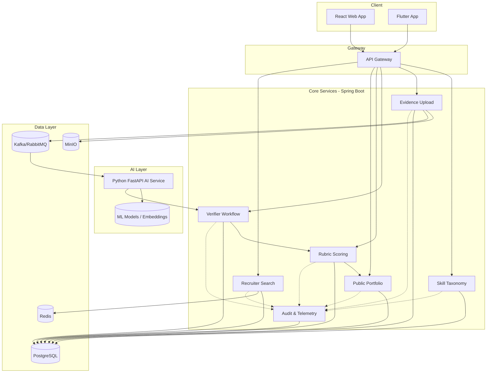
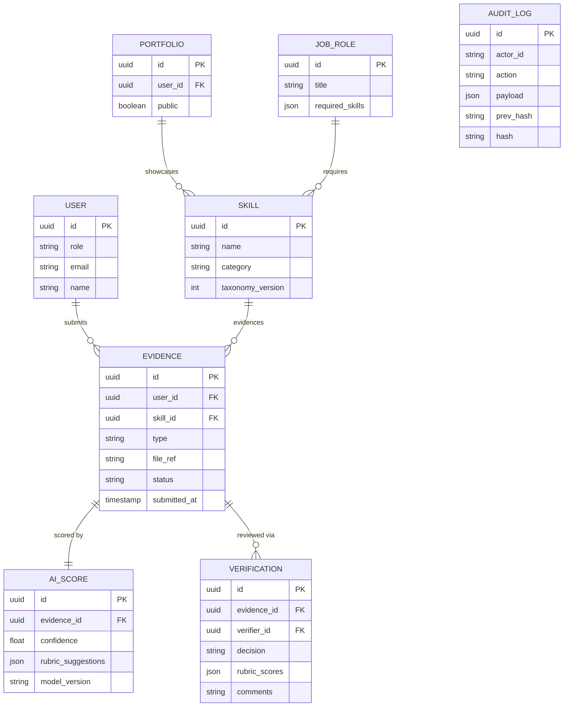
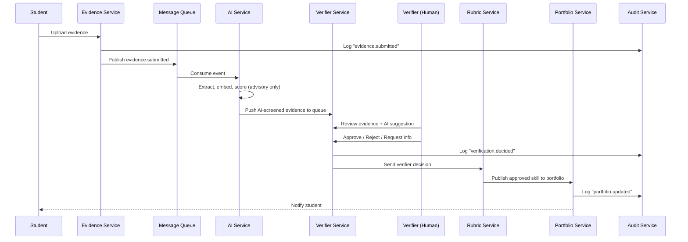

# Master Build Prompt — Skills Evidence Passport
### Full Requirements, Architecture, Backend, Machine Learning, Workflows & UI

> This is the single, self-contained brief for building the entire application — hand it to a dev team or an AI coding agent as the build spec. It supersedes reading the individual planning docs separately.

---

## 1. Project Overview

**Problem**: Resumes list skills without consistent evidence — there's no reliable way to validate project work, certifications, or competency growth.

**What to build**: A working, stakeholder-testable prototype — not a slide deck — where students upload evidence of skills, faculty verifiers validate it against rubrics (AI-assisted, human-decided), validated skills populate a public portfolio, and recruiters/placement teams search and filter candidates by verified competency. Every state change is logged to an immutable audit trail, and the system exposes operational telemetry.

**Core modules required**: skill taxonomy, evidence upload, verifier workflow, rubric scoring, public portfolio, recruiter filters, growth timeline.

**Distinguishing technical contribution**: an industry-style modular architecture with secure APIs, automated tests, containerized deployment, and operational telemetry — benchmarked against a simpler manual/baseline verification process to show where the advanced approach adds value.

---

## 2. Personas & Stakeholders

| Persona | Needs |
|---|---|
| **Student** (18–26) | Submit evidence quickly, track status, build a public portfolio, see skill growth over time |
| **Faculty Verifier** (30–55) | Review many submissions fast, low cognitive load, trust the AI suggestion without being bound by it |
| **Recruiter / Placement Team** (25–45) | Search and filter by verified skill, compare candidates, shortlist quickly |
| **Admin** | System-wide visibility: taxonomy, users, audit, telemetry, without noise |

**Misuse cases to design against**: duplicate/plagiarized evidence submission, a verifier rubber-stamping AI suggestions without review, a recruiter viewing unverified or private-field data, tampering with historical audit records, one role escalating privileges it wasn't granted.

---

## 3. Functional Requirements (by module)

1. **Skill Taxonomy** — CRUD for skills/categories/job-role skill maps; versioned so historical evidence isn't broken by taxonomy changes.
2. **Evidence Upload** — students attach a file or link to a skill, add a description; system validates format/size, virus-scans, stores the file, and kicks off scoring.
3. **AI Validation (advisory only)** — extracts text, checks similarity/duplication, produces a confidence score and rubric suggestions. **Never auto-approves.**
4. **Verifier Workflow** — queued review, state machine (`Draft → Submitted → AI-Screened → In Review → Approved / Rejected / Needs Info`), verifier can accept or override the AI suggestion, comments thread for "needs info" round-trips.
5. **Rubric Scoring** — weighted rubric criteria combine AI score + verifier score into a final competency level.
6. **Public Portfolio** — approved skills publish to a shareable profile with a growth timeline; per-field privacy controls (student opts in to what's visible).
7. **Recruiter Search/Filter** — faceted search over verified, public portfolio data only (skill, proficiency, role fit); shortlisting; side-by-side candidate comparison.
8. **Audit Trail** — every state transition logged, tamper-evident (hash-chained), queryable by admins.
9. **Telemetry** — verification turnaround, queue depth, AI latency, search latency, error rates, all dashboarded.

## 4. Non-Functional Requirements

- **Security**: OAuth2/OIDC auth, RBAC + record-level ABAC, encryption at rest and in transit, dependency/container scanning in CI, a documented threat model.
- **Privacy**: privacy-by-default portfolio (nothing public unless the student opts in), PII never exposed to recruiters beyond what's explicitly shared.
- **Auditability**: immutable, hash-chained logs; no silent edits to history.
- **Reliability**: AI-service downtime must degrade gracefully (evidence still reaches manual review) — never block the core workflow.
- **Performance**: search and dashboard interactions should stay responsive under load-test conditions (see §12 thresholds).
- **Usability**: verification status must always be legible via color + icon + label together, never color alone.

---

## 5. Tech Stack

| Layer | Technology |
|---|---|
| Frontend (Web) | React 18 + TypeScript, Vite, TanStack Query, Tailwind CSS |
| Frontend (Mobile, optional) | Flutter |
| Design | Figma → Google Stitch for high-fidelity screens |
| Backend (Core API) | Java 21, Spring Boot 3.x, Spring Security, Spring Data JPA, Gradle |
| AI/ML Service | Python 3.11, FastAPI, scikit-learn, sentence-transformers, spaCy |
| Experiment Tracking | MLflow (optional) |
| Database | PostgreSQL 15+ (pgvector optional for semantic search) |
| Cache / Messaging | Redis (cache), Kafka or RabbitMQ (event bus) |
| Object Storage | MinIO (S3-compatible) |
| API Contract | OpenAPI 3.1 |
| AuthN/AuthZ | Keycloak (OAuth2/OIDC), JWT, RBAC + ABAC |
| Security Testing | OWASP ZAP, Dependabot/Snyk, Trivy |
| Containers | Docker, Docker Compose, Kubernetes manifests (optional) |
| CI/CD | GitHub Actions |
| Observability | OpenTelemetry, Prometheus, Grafana, Loki/ELK |
| Testing | JUnit 5 + Mockito, Pytest, React Testing Library + Playwright/Cypress, k6/JMeter |

---

## 6. System Architecture



**Module ownership**: package-by-feature "modular monolith" in the backend (each module internally layered `entity → repository → service → controller`, never reaching into another module's internals) — deployable as one service now, splittable into microservices later without a rewrite.

---

## 7. Data Model (Core Entities)



`taxonomy_version` lets the skill ontology evolve without breaking historical records. `AUDIT_LOG` uses hash-chaining (`prev_hash → hash`) for tamper-evidence.

---

## 8. Representative API Contracts

```
POST   /api/v1/evidence                 # Student uploads evidence
GET    /api/v1/evidence/{id}            # Get evidence status
POST   /api/v1/ai/evidence/{id}/score   # AI service callback with score
GET    /api/v1/verifier/queue           # Verifier's pending review queue
POST   /api/v1/verifier/{id}/decision   # Approve/reject/request-info
GET    /api/v1/portfolio/{userId}       # Public portfolio view
GET    /api/v1/recruiter/search?skill=&level=&role=
GET    /api/v1/audit/{entityId}         # Audit trail for an entity
GET    /api/v1/taxonomy                 # Skill taxonomy tree
```

All endpoints authenticated via Keycloak-issued JWT; scopes map to roles (`evidence:write`, `verifier:review`, `recruiter:search`, `admin:manage`).

---

## 9. Core End-to-End Workflow



**Failure handling**: AI-service down/timeout → evidence routes straight to manual verifier queue, SLA clock still starts. Malformed upload → rejected before queuing to AI. Verifier decision always overrides the AI score. Duplicate evidence → flagged via content hash, not auto-blocked. Recruiter search excludes anything not `status = approved`.

---

## 10. Backend Implementation Plan (Java 21 / Spring Boot)

### 10.1 Structure
```
skills-passport-backend/
├── src/main/java/com/passport/
│   ├── config/ taxonomy/ evidence/ verification/ rubric/
│   ├── portfolio/ recruiter/ audit/ common/
│   └── PassportApplication.java
├── src/main/resources/{application.yml, db/migration/}
├── src/test/java/...
└── Dockerfile
```

### 10.2 Build order
1. Bootstrap: Postgres + Flyway, `docker-compose.yml` (Keycloak, Redis, Kafka, MinIO).
2. Security: Spring Security as OAuth2 resource server validating Keycloak JWTs; `@PreAuthorize` role checks.
3. Taxonomy module (simplest — validates the whole stack end to end).
4. Evidence module (multipart upload → MinIO, metadata → Postgres, publish Kafka event).
5. Verification module (Kafka consumer for `evidence.ai_scored`, state machine, queue endpoint).
6. Rubric module (combine AI + verifier scores).
7. Portfolio module (read-optimized, privacy-filtered).
8. Recruiter module (search/filter).
9. Audit module (AOP aspect — applies to all modules automatically).
10. Observability (Micrometer + OpenTelemetry + Actuator).

### 10.3 Key patterns

```java
@Entity @Table(name = "evidence")
public class Evidence {
    @Id @GeneratedValue private UUID id;
    @ManyToOne @JoinColumn(name = "user_id") private User user;
    @ManyToOne @JoinColumn(name = "skill_id") private Skill skill;
    @Enumerated(EnumType.STRING) private EvidenceStatus status = EvidenceStatus.SUBMITTED;
    private String fileRef;
    private Instant submittedAt = Instant.now();
}
```

```java
@Service @RequiredArgsConstructor
public class EvidenceService {
    private final EvidenceRepository repo;
    private final ObjectStorageClient storage;
    private final KafkaTemplate<String, EvidenceSubmittedEvent> kafka;

    @Transactional @Audited(action = "evidence.submitted")
    public Evidence submit(UUID userId, UUID skillId, MultipartFile file, String description) {
        String ref = storage.upload(file);
        Evidence e = new Evidence(userId, skillId, ref, description);
        repo.save(e);
        kafka.send("evidence.submitted", new EvidenceSubmittedEvent(e.getId()));
        return e;
    }
}
```

```java
@RestController @RequestMapping("/api/v1/evidence") @RequiredArgsConstructor
public class EvidenceController {
    private final EvidenceService service;

    @PostMapping(consumes = MediaType.MULTIPART_FORM_DATA_VALUE)
    @PreAuthorize("hasRole('student')")
    public ResponseEntity<EvidenceDto> submit(@RequestParam UUID skillId,
            @RequestPart MultipartFile file, @RequestParam String description,
            @AuthenticationPrincipal Jwt jwt) {
        var e = service.submit(UUID.fromString(jwt.getSubject()), skillId, file, description);
        return ResponseEntity.ok(EvidenceMapper.toDto(e));
    }
}
```

Audit logging is applied via an `@Audited` AOP aspect that hash-chains every logged action — no module needs to write logging code itself.

---

## 11. Machine Learning Implementation Plan (Python / FastAPI)

**Scope discipline**: the AI is advisory only — it never auto-approves. It produces a confidence score and rubric suggestions; the human verifier makes every final decision. State this explicitly in the system/model card.

### 11.1 Three jobs
1. Extract text/metadata from uploaded evidence (PDF/DOCX/OCR).
2. Similarity/duplicate detection (embedding cosine similarity against prior submissions).
3. Rubric-suggestion scoring — a predicted score band + confidence.

### 11.2 Structure
```
ai-service/
├── app/{main.py, api/routes/score.py, pipeline/{extract,embeddings,similarity,rubric_model}.py, consumers/kafka_consumer.py}
├── training/{train_rubric_model.py, data/, mlflow_tracking.py}
├── tests/
└── Dockerfile
```

### 11.3 Scoring endpoint
```python
@app.post("/score", response_model=ScoreResponse)
def score_evidence(req: ScoreRequest):
    text = extract_text(req.file_url)
    embedding = embed(text)
    similarity_flag = check_similarity(embedding, req.skill_id)
    rubric = rubric_model.predict(text, req.skill_id)
    confidence = rubric_model.predict_confidence(text, req.skill_id)
    return ScoreResponse(confidence=confidence, rubric_suggestions=rubric,
                          similarity_flag=similarity_flag, model_version="rubric-v1.2")
```

### 11.4 Kafka consumer (async, decoupled from the request cycle)
```python
for msg in consumer:  # topic: evidence.submitted
    payload = json.loads(msg.value)
    result = score_evidence_internal(payload["evidenceId"])
    producer.send("evidence.ai_scored", json.dumps(result).encode())
```

### 11.5 Training pipeline (scikit-learn + MLflow)
```python
with mlflow.start_run():
    model = GradientBoostingClassifier()
    model.fit(X_train, y_train)
    report = classification_report(y_test, model.predict(X_test), output_dict=True)
    mlflow.log_metrics({"f1": report["weighted avg"]["f1-score"]})
    mlflow.sklearn.log_model(model, "rubric_model")
```

**Features**: text length/structure, keyword/embedding overlap with the skill's taxonomy description, similarity to "strong evidence" exemplars per skill, evidence type, (v2) historical verifier agreement rate.

**Synthetic data**: since real student data won't exist yet, generate labeled synthetic evidence (approved/rejected/needs-info) across skill categories with documented seed and provenance — this is the "data/model/hardware package" deliverable.

**Rollout discipline**: ship a rules-based fallback scorer first (keyword + length heuristics) so the Verifier module has something to consume immediately; swap in the trained model later and run the before/after comparison — that comparison is your innovation-vs-baseline deliverable.

### 11.6 Backend ↔ AI wiring
Primary: async via Kafka (`evidence.submitted → AI → evidence.ai_scored → backend`) — makes AI downtime non-blocking. Secondary: sync REST for on-demand re-scoring, hidden behind an `AiServiceClient` interface on the backend so it's mockable in tests.

---

## 12. Security & Privacy

- Keycloak OIDC, short-lived JWTs, RBAC + record-level ABAC (a verifier sees only their department's evidence).
- Encryption at rest (PII columns) and in transit (TLS); signed URLs for object storage.
- Privacy-by-default portfolio: no field is public unless the student opts in.
- Hash-chained audit log — no silent edits to history.
- STRIDE threat model on upload, auth, and search flows.
- OWASP ZAP baseline scan + Snyk/Trivy dependency and container scans, gating CI merges.
- Responsible-AI review: document model limitations, subgroup bias checks, and the human-override guarantee.

---

## 13. Testing & CI/CD

- **Backend**: JUnit 5 + Mockito (unit), Testcontainers for Postgres/Kafka (integration), WireMock to stub the AI service.
- **AI service**: Pytest per pipeline stage, a golden-dataset regression test (fixed inputs → expected score *ranges*, catches drift), contract tests against the OpenAPI schema.
- **Frontend**: React Testing Library + Playwright/Cypress E2E for all four role journeys.
- **Load**: k6/JMeter against evidence upload and recruiter search.
- **Security**: OWASP ZAP baseline + authenticated scan.
- **Pipeline**: `lint → unit test → build → dependency scan → container build → container scan → integration test → push image → deploy staging → E2E test`. Branch protection requires green CI + one review.

---

## 14. Observability

- **Metrics**: verification turnaround, queue depth, AI scoring latency, search latency, approval/rejection rates (Prometheus/Grafana).
- **Traces**: OpenTelemetry correlating one evidence submission across every service it touches.
- **Logs**: structured, trace-correlated (Loki/ELK) — distinct from the tamper-evident compliance audit log.

---

## 15. UI/UX Reference (condensed — see design.md and screen-flow docs for full detail)

- **Style**: credible, precise, institutional-modern (Credly/DocuSign/Notion territory, not social/gamified).
- **Colors**: Primary `#1E3A8A`, Secondary `#0F766E`, Accent `#B45309` (growth/timeline only), Success/Warning/Error tinted-background pills.
- **Typography**: Inter (UI/body), Plus Jakarta Sans (headings).
- **Layout**: role-scoped sidebar (Verifier/Recruiter/Admin), top nav only for the public/student portfolio view, 12-col grid, 4px spacing scale.
- **38 screens across 5 batches**: Shared (auth/onboarding/notifications) → Student (dashboard, taxonomy browser, upload wizard, status tracker, timeline, portfolio) → Verifier (dashboard, queue, review screen, rubric management) → Recruiter (dashboard, search, candidate profile, shortlist, comparison) → Admin (dashboard, taxonomy/user management, audit log, telemetry).
- Verification status is always color + icon + label together; destructive actions always route through a confirmation dialog; tables share one consistent component (sticky header, zebra rows, row-click detail panel) across every screen that uses one.

---

## 16. Evaluation Metrics & Acceptance Criteria

| Metric | Target |
|---|---|
| Verification turnaround | Median ≤ 48h |
| Portfolio completeness | ≥ 80% of claimed skills have approved evidence |
| Search relevance (Precision@10) | ≥ 0.7 |
| Privacy (PII correctly hidden from unauthorized roles) | 100% — hard gate |
| Usability (SUS score) | ≥ 70 |
| AI-assist value-add | Statistically significant reduction in verifier time-per-review vs. baseline |
| Robustness under load | < 1% failed requests; 100% graceful fallback when AI service is down |

Baseline for comparison: a manual-only verification process (no AI pre-screening, spreadsheet-tracked) — measure the same metrics to show where the AI-assisted, modular architecture adds value.

---

## 17. Deployment

- Two independently containerized services (`backend/Dockerfile`, `ai-service/Dockerfile`) plus one `docker-compose.yml` orchestrating both with Postgres, Kafka, MinIO, Keycloak, Redis, Prometheus, Grafana.
- GitHub Actions runs parallel CI jobs per service, converging on a shared `docker-compose` integration test stage before either image is pushed and deployed to staging.

---

## 18. Deliverables Checklist

| Deliverable | Produced in |
|---|---|
| Industry problem brief | §2–4 (personas, requirements, misuse cases) |
| Solution design pack | §6–8 (architecture, data model, API contracts) + Figma/Stitch UI |
| Integrated MVP prototype | §10–11 (all modules implemented and wired) |
| Innovation module + comparison study | §11.5 rollout discipline — AI model vs. rules-based baseline |
| Data/model/hardware package | §11.5 synthetic data + provenance/data dictionary |
| Engineering evidence pack | §13 CI/CD — issue board, PR history, scan reports |
| Evaluation dossier | §16 metrics + load/security test reports |
| Deployable demonstration | §17 + admin/user guide, demo video, OpenAPI docs |

---

## 19. Sprint Roadmap

| Sprint | Backend | AI Service | Frontend/UI |
|---|---|---|---|
| 0–1 | Personas, backlog, architecture, data model, threat model | — | Figma/Stitch wireframes, design.md |
| 2 | Auth, Taxonomy, Evidence Upload | — | Shared screens, Student upload wizard |
| 3 | Kafka wiring | Skeleton, extraction/embeddings, dummy score | Student dashboard, status tracker |
| 4 | Verifier + Rubric modules | Rules-based fallback scorer live | Verifier queue + review screen |
| 5–6 | Portfolio + Recruiter modules | Train scikit-learn model, MLflow, baseline comparison | Portfolio, recruiter search/comparison |
| 7 | Audit module, observability | Observability, resilience test (kill AI service) | Admin dashboard, telemetry views |
| 8 | Load testing, hardening | Finalize model card, package data artifacts | Polish, empty/loading/error states, demo prep |
